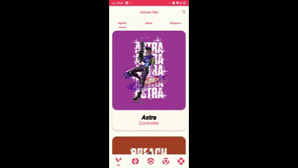
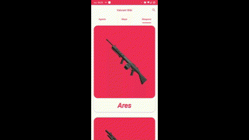

<h1 align="center">Valorant Wiki</h1>

<p align="center">
  <a href="https://opensource.org/licenses/Apache-2.0"></a>
  <a href="https://android-arsenal.com/api?level=26"></a>
  <br>
  <a href="https://www.linkedin.com/in/lucas-mello-a43887188/"></a>
  <a href="mailto:lucasmellorodrigues2012@gmail.com"></a>
</p>

<p align="center">  

⭐ Esse é um projeto de estudos para desenvolvimento Android nativo com kotlin.

🎮 Aplicativo com funcionalidades de consultar informações sobre o jogo Valorant.

</p>


## Download
 Faça o download da <a href="https://github.com/LucasMelll0/Valorant_Wiki/blob/master/apk/app-debug.apk?raw=true">APK diretamente</a>. Você pode ver <a href="https://www.google.com/search?q=como+instalar+um+apk+no+android">aqui</a> como instalar uma APK no seu aparelho android.

## Tecnologias usadas e bibliotecas de código aberto

- Minimum SDK level 26
- [Linguagem Kotlin](https://kotlinlang.org/)

- Jetpack
  - Lifecycle: Observe os ciclos de vida do Android e manipule os estados da interface do usuário após as alterações do ciclo de vida.
  - ViewModel: Gerencia o detentor de dados relacionados à interface do usuário e o ciclo de vida. Permite que os dados sobrevivam a alterações de configuração, como rotações de tela.
  - ViewBinding: Liga os componentes do XML no Kotlin através de uma classe que garante segurança de tipo e outras vantagens.
 - Retrofit: Faz a comunicação com a web api em busca das informações desejadas.
  - Custom Views: View customizadas feitas do zero usando XML.
  - [...]

- Arquitetura
  - MVVM (View - ViewModel - Model)
  - Comunicação da ViewModel com a View através de LiveData
  - Comunicação da ViewModel com a Model através de Kotlin Flow
  - Repositories para abstração da comunidação com a camada de dados.
  
- Bibliotecas
  - [Coil](https://github.com/coil-kt/coil): Para carregamento de imagens e cacheamento das mesmas.
  - [Koin](https://insert-koin.io/): Para injeção de depêndencias.
  - [Moshi](https://github.com/square/moshi): Para conversão json -> classe kotlin.

## Arquitetura
**Valorant Wiki** utiliza a arquitetura MVVM e o padrão de Repositories, que segue as [recomendações oficiais do Google](https://developer.android.com/topic/architecture).
</br></br>

<br>

## Features

### Filtro de Agentes


Uso de BottomNavigation e diffUtils para o filtro.

### Pesquisa de Agentes


Uso de SearchView

### Detalhes dos Agentes



### Detalhes dos Mapas


Uso de TabLayout para navegação entre agentes e mapas.
ViewPager2 para galeria de imagens.

### Detalhes das Armas


Uso de BottomSheet para mostrar as skins das armas.


# Licença
```xml

Licensed under the Apache License, Version 2.0 (the "License");
you may not use this file except in compliance with the License.
You may obtain a copy of the License at

   http://www.apache.org/licenses/LICENSE-2.0

Unless required by applicable law or agreed to in writing, software
distributed under the License is distributed on an "AS IS" BASIS,
WITHOUT WARRANTIES OR CONDITIONS OF ANY KIND, either express or implied.
See the License for the specific language governing permissions and
limitations under the License.
```
